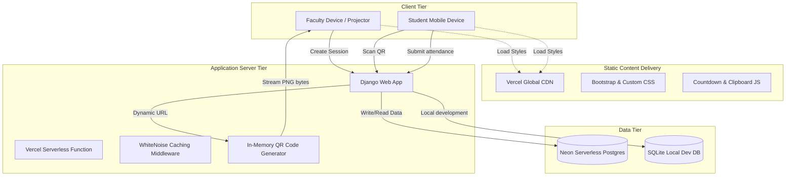
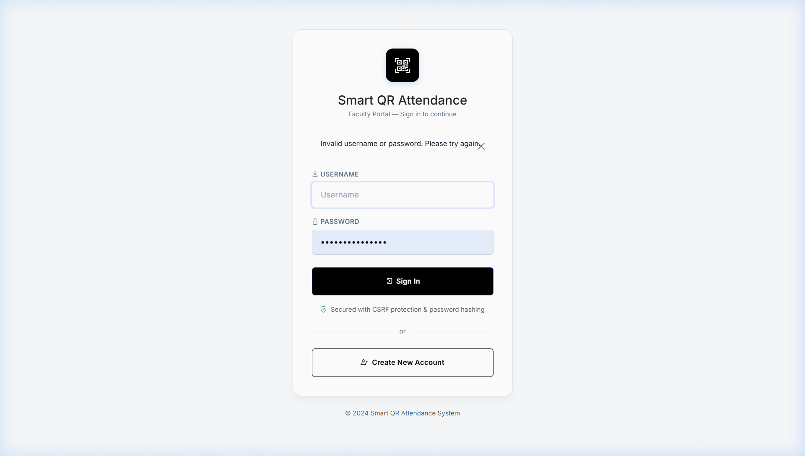
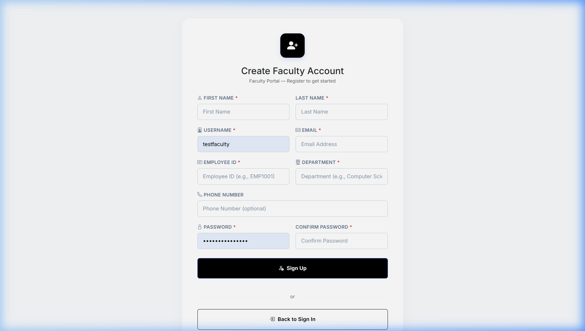

# 🎓 Smart QR Attendance System

A modern, secure, and robust full-stack web application designed to automate student attendance marking in college classrooms. The system replaces traditional manual attendance sheets with dynamic, time-limited, and fraud-resistant QR codes.

---

## 🏗️ System Architecture

The application is built using a modern full-stack web architecture, designed specifically to run reliably in both traditional virtual machine environments and serverless containerized runtimes (like Vercel).



---

## 📸 Screenshots

Here are some preview captures of the application user interface:

### 1. Faculty Login Portal
Beautiful, clean, and responsive design for secure faculty access.



### 2. Faculty Registration Portal
Allows new instructors to set up accounts and configure their departments.



---

## ⚡ Key Features

* **Dynamic In-Memory QR Codes**: Streamed directly to the browser as PNG binary bytes. No disk write operations occur, making the application 100% compatible with read-only serverless platforms like Vercel.
* **Fraud & Spoofing Protection**:
  * **Cryptographic Tokens**: Each QR code embeds a secure, random session token to prevent URL manipulation.
  * **IP Address Logs**: Audits student IP addresses.
  * **LAN/Wi-Fi Restriction**: Faculty can toggle network-range restrictions (e.g., locking access to college Wi-Fi subnet `192.168.*.*`).
  * **Anti-Duplicate Rule**: Prevents multiple submissions from the same roll number in a single session.
* **Faculty Dashboard**: Displays real-time student count and lists students as they register, complete with countdown timer.
* **Media & Links**:
  * Allows uploading student photos during submission (optional, toggled by faculty).
  * Auto-redirects students to custom URLs (Google Meet, Zoom, or online course material) upon successful check-in.
* **Report Generation**: Export full attendance reports to Excel (`.xlsx`) or CSV formats.

---

## 🛠️ Tech Stack

* **Backend**: Django 6.0.6 (Python 3.x)
* **Database**: Neon Serverless PostgreSQL (Production) / SQLite (Local)
* **Frontend**: HTML5, CSS3, Vanilla JavaScript, Bootstrap 5, Bootstrap Icons
* **Static Assets Servicing**: WhiteNoise (compiles and serves static assets efficiently)
* **Hosting Platform**: Vercel Serverless Cloud

---

## 🚀 Getting Started

### 1. Local Setup
To run the project on your development machine:

1. **Clone the repository**:
   ```bash
   git clone https://github.com/ranveer6713/Smart-QR.git
   cd Smart-QR
   ```

2. **Set up a virtual environment**:
   ```bash
   python -m venv venv
   # On Windows:
   venv\Scripts\activate
   # On macOS/Linux:
   source venv/bin/activate
   ```

3. **Install dependencies**:
   ```bash
   pip install -r requirements.txt
   ```

4. **Environment Variables**:
   Create a `.env` file in the root folder (see `.env.example`):
   ```env
   DJANGO_SECRET_KEY="your-secret-key"
   DATABASE_URL="your-neon-postgres-connection-string" # Leave blank to use local SQLite
   ```

5. **Run migrations and start server**:
   ```bash
   python manage.py migrate
   python manage.py runserver 0.0.0.0:8000
   ```
   *Note: Exposing the server on `0.0.0.0` allows students on the same local network (Wi-Fi) to scan the QR code and connect directly to your laptop.*

### 2. Vercel Deployment

1. Set up a **Neon PostgreSQL** database project and copy the connection string.
2. In the Vercel Project Dashboard, navigate to **Settings > Environment Variables** and add:
   * `DATABASE_URL`: Your Neon Postgres connection string.
   * `DJANGO_SECRET_KEY`: A secure random string.
   * `DJANGO_DEBUG`: `False` (for production).
3. Connect your GitHub repository to Vercel. Vercel will automatically build and deploy the app using the configurations in `vercel.json` and `build_files.sh`.
